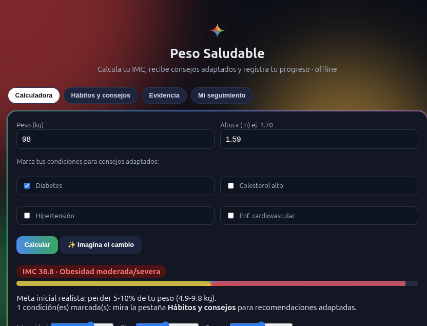
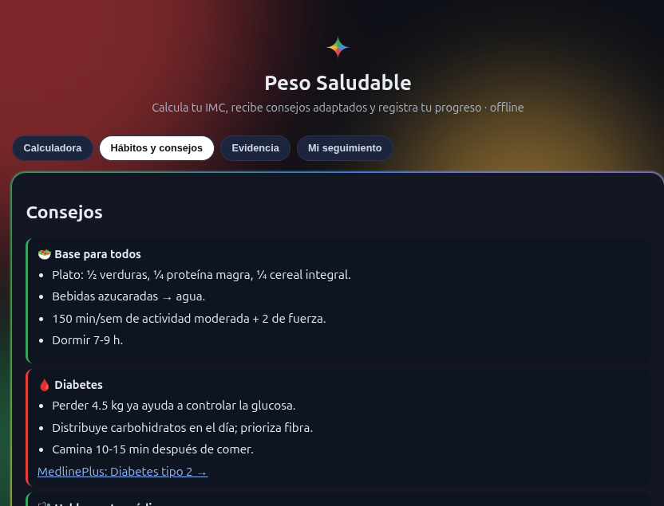
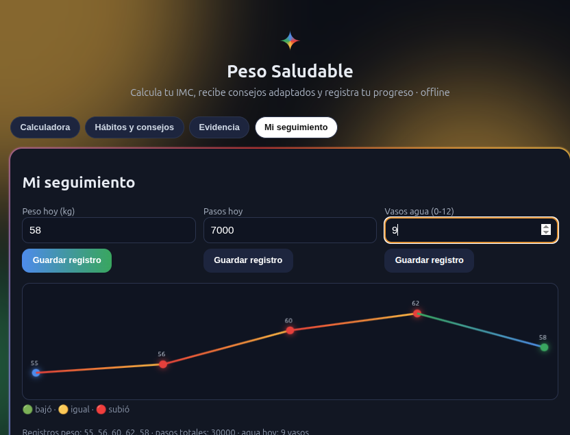

# Pesos saludables y estilos de vida ✦

Una web interactiva en español para comprender algunos indicadores de salud (como el IMC), recibir consejos educativos adaptados a tus situaciones, cuidar hábitos y registrar tu evolución. Todo en una sola página.

## Abrir la web

[Visitar Pesos saludables y estilos de vida](https://martnmartnez14.github.io/peso-saludable/)

También funciona sin internet: descarga el archivo `index.html` y ábrelo en el navegador.

## Capturas

**Calculadora de IMC y condiciones**



**Consejos adaptados** (por ejemplo, si marcas diabetes)



**Seguimiento** con gráfica de peso, pasos y agua



> Las capturas corresponden a la primera versión de la interfaz. Las actualizaremos más adelante.

## Qué incluye

- Calculadora de IMC para adultos, con clasificación no estigmatizante (bajo peso, rango de peso saludable, sobrepeso, obesidad clase I/II/III) y la aclaración de que el IMC es una herramienta de cribado poblacional, no un diagnóstico.
- Consejos educativos generales y adaptados según las situaciones que marques.
- Pestaña de evidencia con guías y publicaciones científicas verificadas (OMS, ADA, AHA/ACC, ACOG, KDIGO, ESPEN, ACR, EFSA, MedlinePlus…), organizadas por temas y con indicación del tipo de fuente.
- Seguimiento de peso, pasos y agua, guardado en el navegador (`localStorage`), con gráfica de los últimos 30 registros.
- Fondo ambient con paleta azul / rojo / amarillo / verde, estrella animada y controles de intensidad, blur y spread.
- Funcionamiento online (GitHub Pages) y offline (archivo único).

## Condiciones disponibles

Puedes marcar estas situaciones para ver bloques educativos específicos (no son diagnósticos):

1. Diabetes
2. Colesterol alto (dislipidemias)
3. Hipertensión
4. Enfermedad cardiovascular
5. Embarazo (con advertencia específica sobre el IMC y sin metas de pérdida de peso)
6. Lactancia
7. Enfermedad renal (sin "dieta renal" universal: la nutrición se individualiza)
8. Adulto mayor (énfasis en función, fuerza y no solo en el peso)
9. Hiperuricemia / gota
10. Patología gástrica / gastrointestinal

## Población

**Esta herramienta está diseñada para personas adultas (18 o más años).** No está adaptada para evaluar peso, IMC o crecimiento en niños y adolescentes, que requieren curvas de crecimiento y evaluación pediátrica.

## Privacidad

- No existe servidor de datos, cuentas, cookies, analítica ni telemetría.
- El seguimiento de peso, pasos y agua se guarda únicamente en el `localStorage` del navegador (`pesoAppV2`, con migración desde `pesoAppV1`).
- Las casillas de condiciones no se guardan entre sesiones.
- Nada de lo que registres se envía a ningún servidor.

## Evidencia

El contenido educativo se apoya en guías clínicas, revisiones sistemáticas y organismos oficiales (OMS, ADA, AHA/ACC, ACOG, KDIGO, ESPEN, ACR, EFSA, NIH/MedlinePlus, entre otros). Cada referencia en la pestaña *Evidencia* indica organismo/autor, año, título resumido y enlace. La información es educativa y no realiza diagnósticos ni sustituye la valoración de profesionales de la salud.

## Para quien desarrolla

Un solo archivo HTML (`index.html`) con CSS y JavaScript incluidos. Sin dependencias, sin frameworks, sin build, sin backend.

| Archivo | Uso |
| --- | --- |
| `index.html` | App (GitHub Pages sirve este archivo) |
| `docs/images/` | Capturas del README |
| `.nojekyll` | Evita que GitHub Pages procese la carpeta `docs` como Jekyll |

Para probar en local:

```bash
python3 -m http.server 8765
```

Abre [http://127.0.0.1:8765](http://127.0.0.1:8765).

Hecho con HTML, CSS y JavaScript; preparado para GitHub Pages.

## Apoyar el proyecto

¿Te gustó el proyecto? Si quieres colaborar voluntariamente, puedes invitarme a un cafecito o mate.

- [Ko-fi](https://ko-fi.com/martinmartinezgarcia)
- [PayPal](https://www.paypal.com/paypalme/blufferedtwitch)
- [Internet satelital Starlink](https://starlink.com/es?referral=RC-DF-5848974-78640-68&app_source=share) (enlace de afiliado; puede ofrecerte el primer mes según las condiciones vigentes de Starlink)
